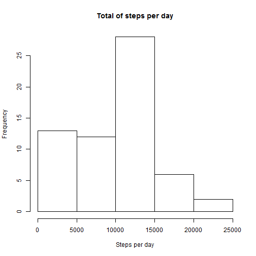
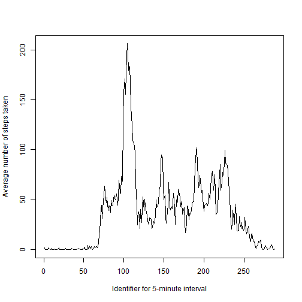
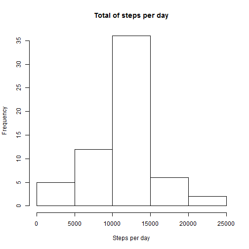
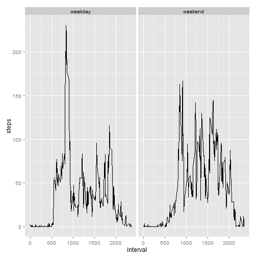

# Peer Assessment 1

## Loading and processing data.

```r
temp<-tempfile()
download.file("http://d396qusza40orc.cloudfront.net/repdata%2Fdata%2Factivity.zip",temp)
con<-unz(temp,"activity.csv")
df<-read.table(con,header=T,sep=",")
unlink(temp)             
library(dplyr)
```

## What is mean total number of steps taken per day?
Missing values were removed. 


```r
byDate<-group_by(df,date)
df1<-summarize(byDate,steps=sum(steps,na.rm=T))
hist(df1$steps,xlab="Steps per day",ylab="Frequency",main="Total of steps per day")
```

 

```r
x<-mean(df1$steps)
y<-median(df1$steps)
```

The mean is 9354.2295082 steps per day. And the median is 10395 steps per day.

## What is the average daily activity pattern?
Missing values were removed.


```r
byInterval<-group_by(df,interval)
df2<-summarize(byInterval,steps=mean(steps,na.rm=T))
plot(df2$steps,type="l",ylab="Average number of steps taken",xlab="Identifier for 5-minute interval")
```

 

```r
maximum<-df2[which(df2$steps==max(df2$steps)),]
z<-maximum[1]
```

The 5-minute interval which contains the maximum number of steps is 835.

## Imputing missing values


```r
na_values<-sum(is.na(df$steps))
```

The total number of missing values is 2304

The Strategy for filling all of the missing values is: The mean for that 5-minute interval.


```r
output<-data.frame()
for(i in 1:length(unique(df$interval)))
{
  df3<-df[which(df$interval==unique(df$interval)[i]),]
  new_value<-df2[which(df2$interval==unique(df$interval)[i]),2]
  new_value<-as.data.frame(new_value)
  colnames(new_value)<-c("steps")
  for(j in 1:nrow(df3))
  {
    if(is.na(df3[j,1]))
    {
      df4<-df3[j,2:3]
      df4<-cbind(new_value,df4)
    }
    else
    {
      df4<-df3[j,]
    }
    output<-rbind(output,df4)
  }
}
byDate1<-group_by(output,date)
df5<-summarize(byDate1,steps=sum(steps))
hist(df5$steps,xlab="Steps per day",ylab="Frequency",main="Total of steps per day")
```

 

```r
a<-mean(df5$steps)
b<-median(df5$steps)
c<-sum(df5$steps)-sum(df1$steps)
```

The mean is 1.0766189 &times; 10<sup>4</sup> steps per day. And the median is 1.0766189 &times; 10<sup>4</sup> steps per day. The values differ from the estimates for 1st part of the assignment. The impact of imputing missing data is 8.6129509 &times; 10<sup>4</sup> additional steps. 

## Are there differences in activity patterns between weekdays and weekends?


```r
output<-mutate(output,asDate=as.Date(date))
newcol<-data.frame()
for(i in 1:length(output$asDate))
{
  if(weekdays(output$asDate[i])=="Saturday"||weekdays(output$asDate[i])=="Sunday")
  {
    wDay<-as.data.frame(c("weekend"))
  }
  else
  {
    wDay<-as.data.frame(c("weekday"))
  }
  colnames(wDay)<-c("wDay")
  newcol<-rbind(newcol,wDay)
}
output<-cbind(output,newcol)
byInterval1<-group_by(output,interval,wDay)
df6<-summarize(byInterval1,steps=mean(steps))
library(ggplot2)
p<-qplot(interval,steps,data=df6,facets=.~wDay,geom="line")
p
```

 
